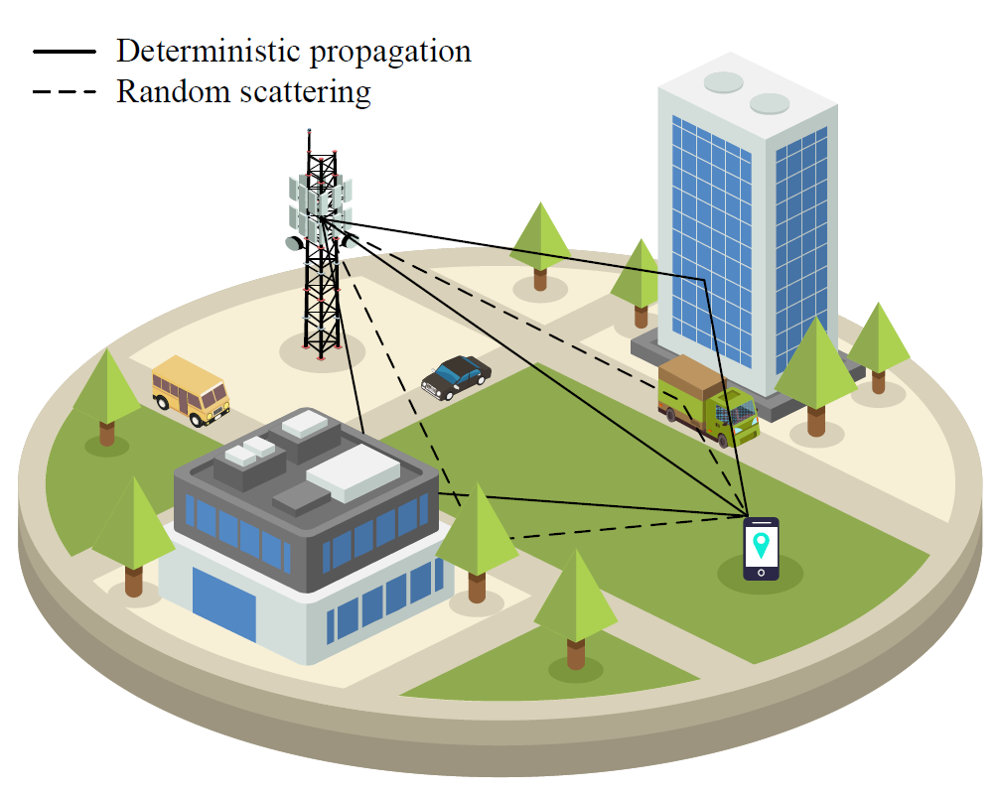

# 🚨 reduced-pilots  

[](https://github.com/yangbin-xd/reduced-pilots)
[](https://ieeexplore.ieee.org/document/11008499)
[](https://opensource.org/licenses/MIT)


The channel model of wireless communications with deterministic propagation and random scattering.    

## 📝 Information:
This is the source code for _IEEE Trans. Wireless Commun._ paper  
__"Radio Map-Based Beamforming Assisted with Reduced Pilots"__   
https://ieeexplore.ieee.org/document/11008499  
_Welcome to cite this article !_

```bibtex
@article{yang2025radio,
  title={Radio map-based beamforming assisted with reduced pilots},
  author={Yang, Bin and Wang, Wei and Zhang, Wei},
  journal={IEEE Trans. Wireless Commun.},
  volume={24},
  number={10},
  pages={8878--8891},
  month={Oct.},
  year={2025},
  publisher={IEEE}
}
```
Video introducing radio map: https://www.youtube.com/watch?v=KqihgPd0c2o

## 🛠️ Please follow the following steps:
__1. Configure virtual environment for this repository__  
```python
# Create virtual environment for this repository (python3.8)  
python3 -m venv env_RP

# Activate the created environment
source env_RP/bin/activate
```

__2. Download the repository to local__
```python
# git clone the repository to your folder
git clone https://github.com/yangbin-xd/reduced-pilots.git  

# cd to the folder
cd reduced-pilots
```

__3. Install the required modules__
```python
# pip install required modules according to the requirements
pip install -r requirements.txt --no-deps

#  Please uninstall the numpy with high version
pip uninstall numpy

# And degrade the numpy version to 1.19.5
pip install numpy==1.19.5
```

__4. Then, you can run files__
```python
# run benchmark of location-based beamforming   
python GBM.py

# And benchmark of channel knowledge map
python CKM.py

# The proposed reduced pilots-based beamforming  
python reduced_pilot.py

# The proposed radio map-based beamforming
python radio_map.py

# The integration of radio map and reduced pilots
python integrate.py

# The integration with SVM-based discriminator
python integrate_svm.py
```

## 👤 Authors:  
authors: Bin Yang∗, Wei Wang†, Wei Zhang∗  
∗University of New South Wales, Sydney, NSW 2052, Australia   
†Peng Cheng Laboratory, Shenzhen 518055, China  
Email: bin.yang@unsw.edu.au, wangw01@pcl.ac.cn, w.zhang@unsw.edu.au  

## 📨 Contact:  
If you have any questions about this code, you are welcome to contact me via:  
binyang_2020@163.com  

## 🗂️ Introduction:  
data is the dataset generated by DeepMIMO                
model is to save the deep learning model  
result is to save the generated pictures  
dataset.py is the file to generate dataset by DeepMIMO (pip install DeepMIMO)  
utils.py is the functions used in this source code  
scenario.ipynb is to plot the scenario generated by DeepMIMO  
GBM.py is the geometry based method  
CKM.py is the channel knowledge map  
radio_map.py is the radio map method  
reduced_pilot.py is the reduced pilots method
integrate.py is the integration scheme  
label.py is the binary label for classification  
integrate_svm.py is the integration scheme with SVM-based discriminator   
fig1.py is the code to plot Fig. 9 in the paper  
fig2.py is the code to plot Fig. 10 in the paper  
fig3.py is the code to plot Fig. 11 in the paper  
fig4.py is the code to plot Fig. 12 in the paper  
fig5.py is the code to plot Fig. 13 in the paper  
fig6.py is the code to plot Fig. 14 in the paper  
fig7.py is the code to plot Fig. 15 in the paper  
fig8.py is the code to plot Fig. 16 in the paper  
fig9.py is the code to plot Fig. 17 in the paper  
fig10.py is the code to plot Fig. 18 in the paper  

## 🚀 Environment:  
numpy                   1.19.5  
matplotlib              3.6.3  
keras                   2.6.0  
tensorflow-gpu          2.6.0  
__Details please see requirements.txt__
